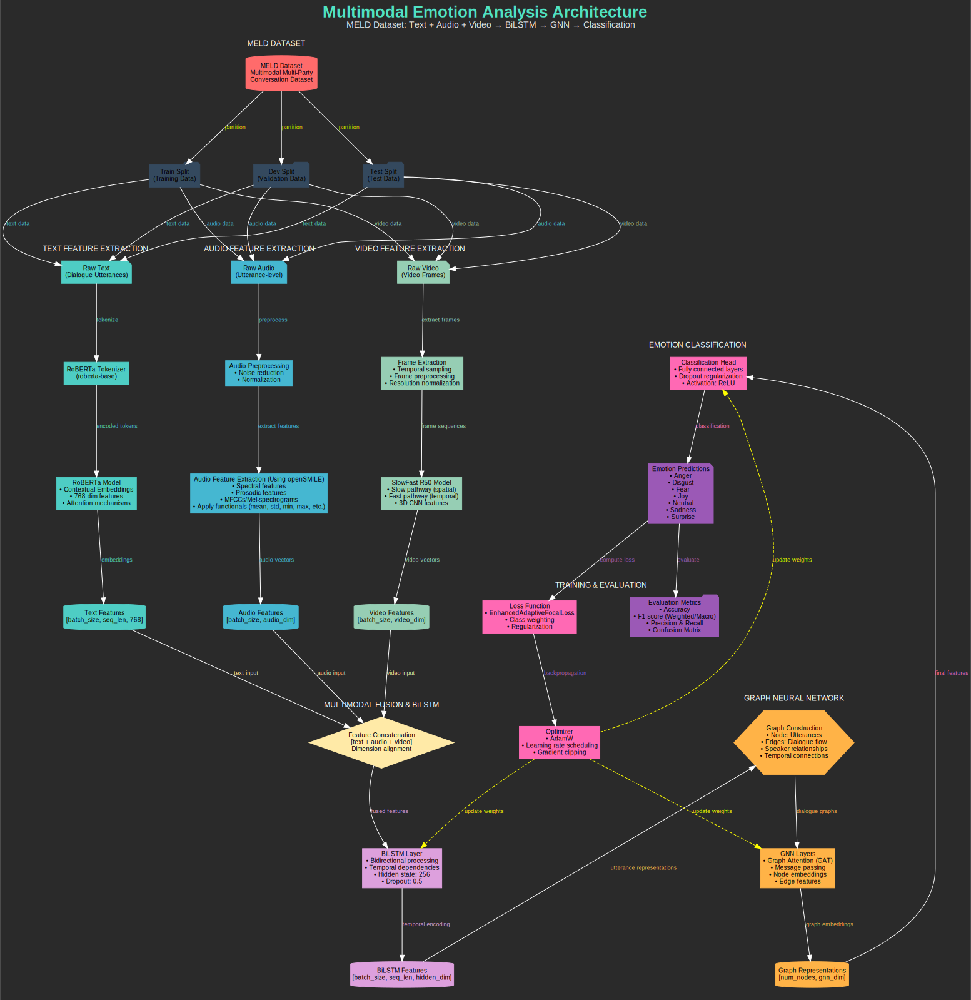

# Multimodal Emotion Analysis Architecture Documentation

## Objective

This system performs emotion recognition in multimodal conversations using text, audio, and video modalities from the MELD dataset with sophisticated neural network architectures.

## Architecture Overview

The complete workflow of the multimodal emotion analysis architecture shows data flow from input modalities through processing stages to final emotion classification, as illustrated below.

*`Figure 1: Complete workflow of the multimodal emotion analysis architecture showing data flow from input modalities through processing stages to final emotion classification.`*

## Architectural Pipeline

### Dataset and Data Management
>*Red/Dark Gray Components*

The MELD Dataset serves as a Multimodal Multi-Party conversation dataset. The system implements a three-way Data Split creating Train/Dev/Test partitions for robust evaluation. The Data Format consists of synchronized multimodal data containing Text + Audio + Video per utterance.

### Multimodal Feature Extraction
>*Teal/Blue/Green Components*

#### Text Processing
>*Teal*

Raw dialogue utterances are processed through RoBERTa tokenizer (roberta-base), which generates contextual embeddings with attention mechanisms. The output produces 768-dimensional text features per utterance.

#### Audio Processing
>*Blue*

Raw audio undergoes preprocessing including noise reduction and normalization. The system then performs utterance-level feature extraction covering spectral, prosodic, and MFCCs analysis. The output generates audio feature vectors capturing vocal characteristics.

#### Video Processing
>*Green*

Raw video is processed through frame extraction with temporal sampling. The SlowFast R50 model operates with dual pathways where the slow pathway captures high-resolution spatial features and the fast pathway processes low-resolution temporal dynamics. The output produces video feature vectors capturing facial expressions and gestures.

### Multimodal Fusion & Sequential Modeling
>*Yellow/Plum Components*

The system performs feature concatenation followed by dimension alignment, then BiLSTM processing to generate temporally-aware representations. The BiLSTM Configuration includes bidirectional processing that captures past and future context, with hidden state dimensions of 256 and dropout regularization. The output produces temporally-aware multimodal representations.

### Graph Neural Network Processing
>*Orange Components*

#### Graph Construction from BiLSTM Features
The system creates nodes representing individual utterances with their representations. Edges establish dialogue flow, speaker relationships, and temporal connections.

#### GNN Layers (Graph Attention Networks)
The architecture implements message passing between connected utterances, attention mechanisms for importance weighting, and node embedding updates through neighborhood aggregation. The output generates context-aware graph representations.

### Emotion Classification
>*Pink/Purple Components*

Graph representations are processed through a classification head consisting of fully connected layers with ReLU activation. The system applies dropout regularization to prevent overfitting and produces seven-class emotion predictions covering Anger, Disgust, Fear, Joy, Neutral, Sadness, and Surprise.

### Training & Evaluation
>*Pink/Purple Components*

The training component uses cross-entropy loss function with class weighting, AdamW optimizer with learning rate scheduling, and gradient clipping for stable training. Evaluation metrics include accuracy, F1-score (Weighted/Macro), precision, recall, and confusion matrix analysis.

## Information Flow

### Pipeline Overview

The `INPUT STAGE` processes MELD Dataset through Train/Dev/Test Splits into parallel modality processing.

The `FEATURE EXTRACTION STAGE` handles text through RoBERTa to generate text features, audio through preprocessing and feature extraction to produce audio features, and video through frame extraction and SlowFast R50 to create video features.

The `FUSION STAGE` combines Text + Audio + Video through concatenation and BiLSTM processing to generate temporal features.

The `GRAPH PROCESSING STAGE` transforms temporal features through graph construction and GNN processing to produce graph representations.

The `CLASSIFICATION STAGE` processes graph representations through the classifier to generate emotion predictions and evaluation results.

The `TRAINING LOOP` cycles through predictions, loss computation, backpropagation, and weight updates.

## Key Architectural Innovations

The system implements multimodal fusion through comprehensive integration of text, audio, and video. Temporal modeling uses BiLSTM to capture sequential dependencies in conversations. Graph structure employs GNN to model complex dialogue relationships and speaker interactions. Attention mechanisms operate in both RoBERTa and GNN for selective focus. Robust evaluation uses multi-split validation with comprehensive metrics.

## Expected Capabilities

The architecture provides context-aware emotion recognition leveraging multiple modalities, speaker-specific and dialogue-flow-aware predictions, temporal consistency in emotion recognition across conversation turns, and robust performance across different conversation types and speakers.

## Technical Specifications

Text processing utilizes RoBERTa-base with 768-dim embeddings. Video processing employs SlowFast R50 for 3D CNN features. Audio processing combines spectral + prosodic features. The sequential model uses BiLSTM with 256 hidden units in bidirectional configuration. The graph network implements GNN with Graph Attention Networks and message passing. Classification covers 7 emotion categories. Regularization includes dropout, gradient clipping, and weight decay.

## Implementation Notes

This architecture represents a state-of-the-art approach to multimodal emotion analysis, combining the strengths of transformer-based language models, advanced computer vision techniques, and graph neural networks for comprehensive conversational emotion understanding.