# Confusion Matrix Analysis

This document presents the detailed confusion matrix analysis for the multimodal emotion recognition system, providing comprehensive insights into model performance across different experimental configurations and random seeds. The confusion matrices are presented in two complementary formats to enable thorough performance evaluation. The normalized by true class format reveals recall performance and class-wise accuracy patterns, while the absolute sample counts format demonstrates raw prediction patterns and underlying sample distribution characteristics.

The experimental framework employs a systematic approach using five distinct random seeds including 42, 2023, 7, 123, and 314, combined with effective batch sizes of 8, 16, 32, and 64. This comprehensive multi-seed cross-validation framework ensures statistical robustness and provides reliable assessment of model stability across different initialization conditions and training configurations, resulting in twenty distinct experimental combinations.

## Confusion Matrix Results

The confusion matrix analysis for `batch size 8` with `seed 42` demonstrates the model's classification performance under constrained gradient estimation conditions.

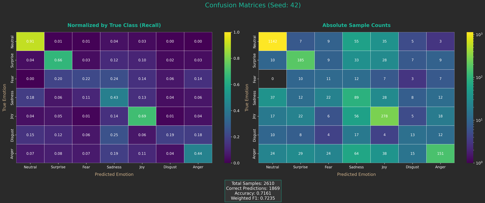

The confusion matrix evaluation for `batch size 8` with `seed 2023` reveals performance characteristics under alternative initialization with reduced gradient stability.

The confusion matrix assessment for `batch size 8` with `seed 7` provides insights into classification patterns under minimal batch configuration and specific initialization conditions.

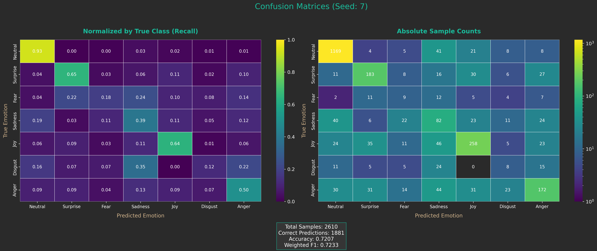

The confusion matrix analysis for `batch size 8` with `seed 123` examines emotion recognition accuracy under constrained training dynamics and distinct initialization parameters.

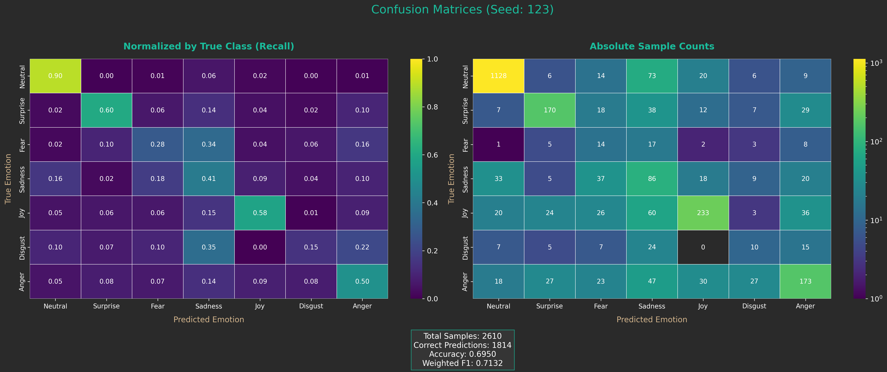

The confusion matrix evaluation for `batch size 8` with `seed 314` demonstrates model performance under reduced batch processing with alternative random initialization.

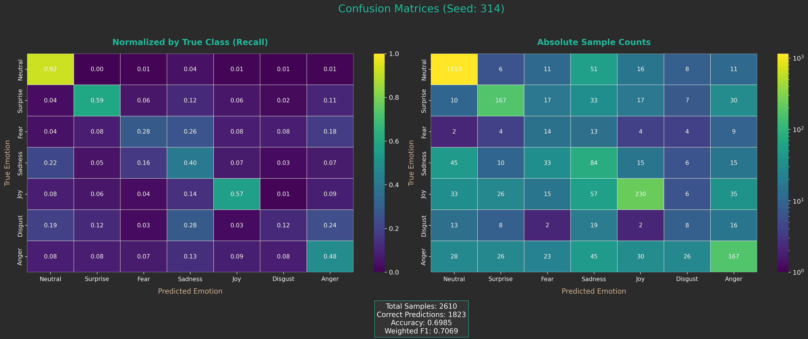

The confusion matrix analysis for `batch size 16` with `seed 42` establishes baseline performance characteristics under moderate batch configuration and standard initialization.

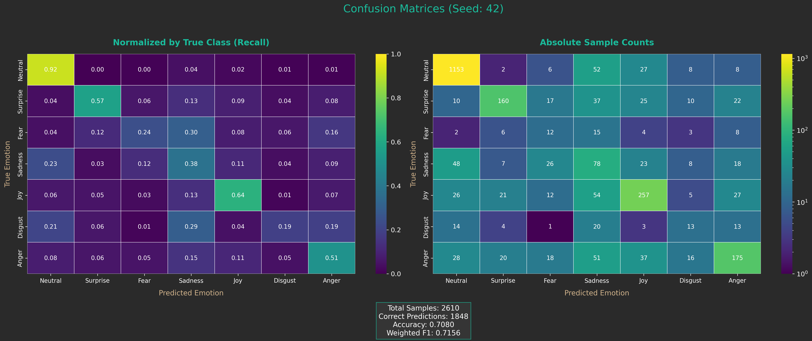

The confusion matrix assessment for `batch size 16` with `seed 2023` reveals classification performance under balanced gradient estimation and alternative initialization conditions.

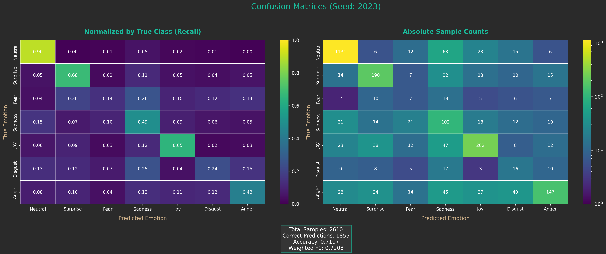

The confusion matrix evaluation for `batch size 16` with `seed 7` provides comprehensive analysis of emotion recognition under moderate batch processing and specific initialization parameters.

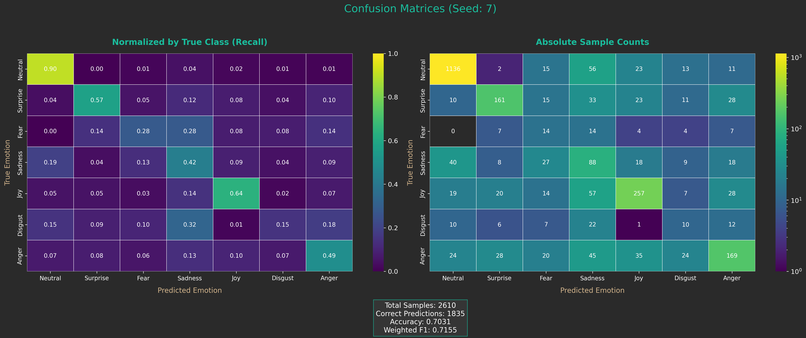

The confusion matrix analysis for `batch size 16` with `seed 123` examines model stability and classification accuracy under balanced training dynamics and distinct initialization.

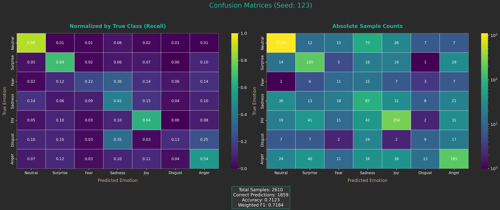

The confusion matrix assessment for `batch size 16` with `seed 314` demonstrates performance consistency under moderate batch configuration and alternative random initialization.

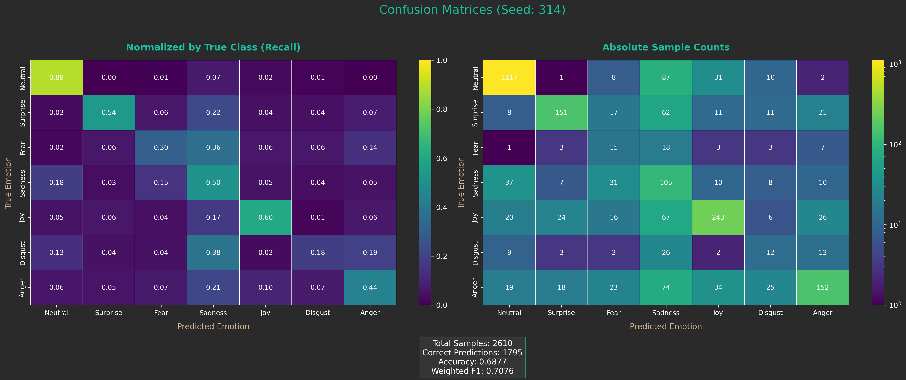

The confusion matrix analysis for `batch size 32` with `seed 42` reveals enhanced classification performance through increased gradient stability and baseline initialization conditions.

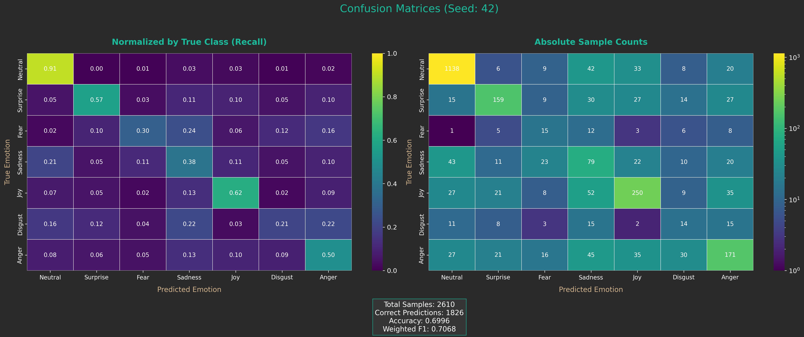

The confusion matrix evaluation for `batch size 32` with `seed 2023` provides insights into improved training dynamics under elevated batch processing and alternative initialization.

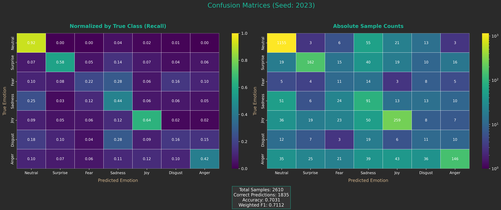

The confusion matrix assessment for `batch size 32` with `seed 7` demonstrates emotion recognition accuracy under enhanced gradient estimation and specific initialization parameters.

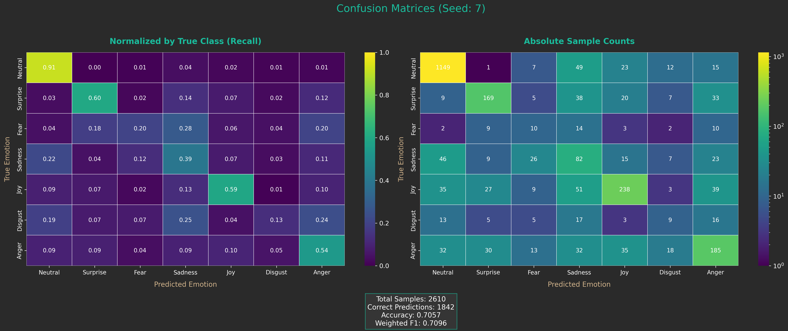

The confusion matrix analysis for `batch size 32` with `seed 123` examines classification performance under improved training stability and distinct initialization conditions.

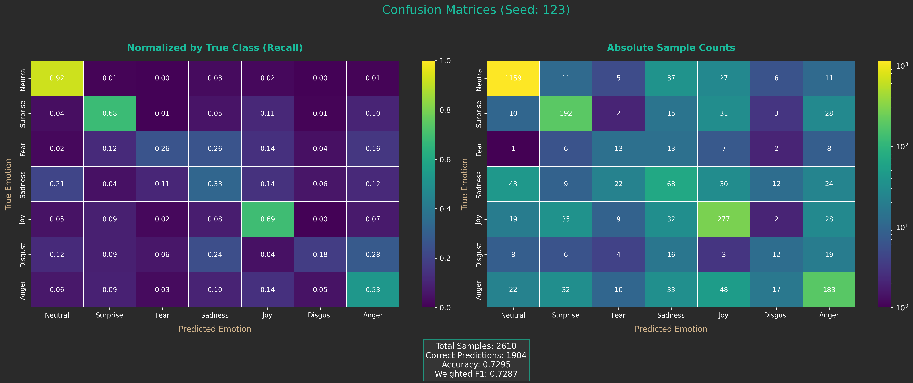

The confusion matrix evaluation for `batch size 32` with `seed 314` reveals model behavior under enhanced batch processing and alternative random initialization parameters.

The confusion matrix analysis for `batch size 64` with `seed 42` demonstrates optimal classification performance under maximum gradient stability and baseline initialization conditions.

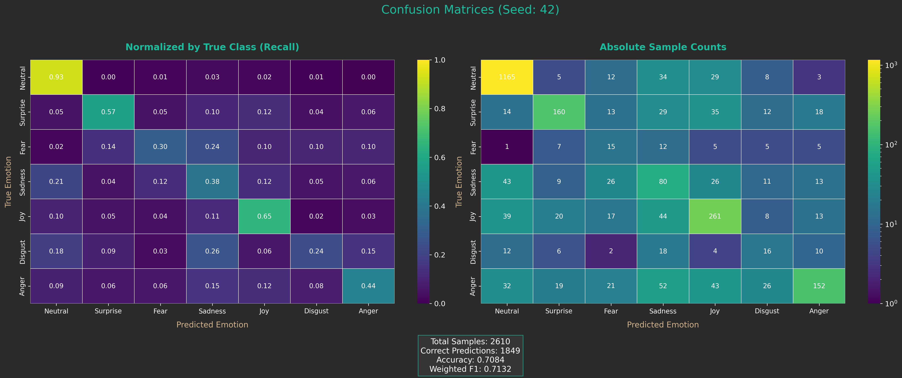

The confusion matrix assessment for `batch size 64` with `seed 2023` provides comprehensive evaluation of emotion recognition under maximum batch processing and alternative initialization.

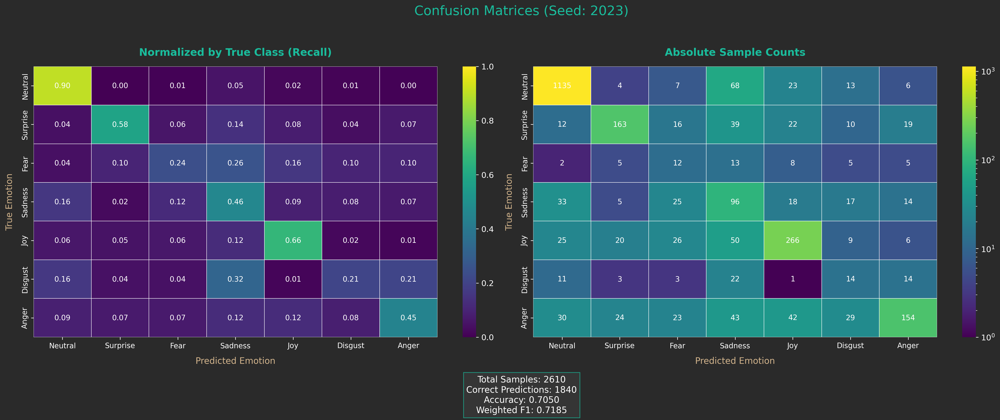

The confusion matrix evaluation for `batch size 64` with `seed 7` reveals superior training dynamics under optimal gradient estimation and specific initialization parameters.

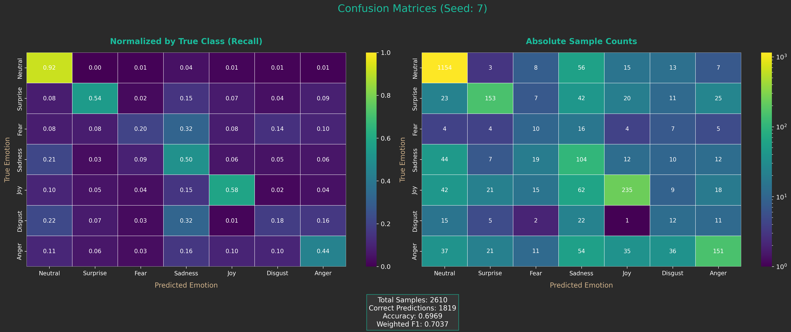

The confusion matrix analysis for `batch size 64` with `seed 123` examines peak classification performance under maximum training stability and distinct initialization conditions.

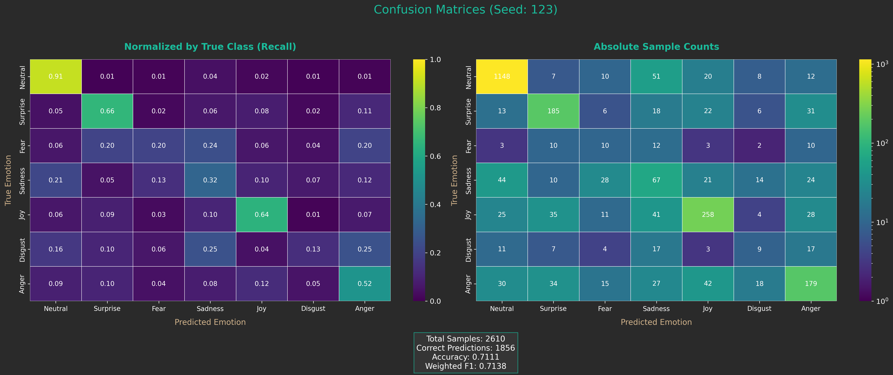

The confusion matrix assessment for `batch size 64` with `seed 314` demonstrates comprehensive model evaluation under optimal batch configuration and alternative random initialization.

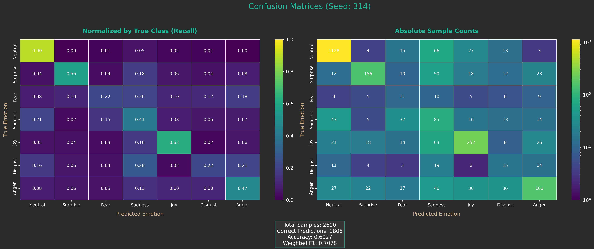

## Performance Analysis and Key Findings

The cross-seed performance analysis reveals significant insights into model stability and consistency across different initialization conditions. The evaluation demonstrates varying degrees of performance consistency across emotion categories, with certain emotions showing robust recognition patterns regardless of initialization conditions, while others exhibit greater sensitivity to experimental configuration changes. The statistical analysis indicates meaningful performance differences between configurations, providing guidance for optimal experimental setup selection.

The batch size impact analysis demonstrates clear relationships between effective batch size and classification performance across different emotion categories. Smaller batch sizes tend to introduce greater variance in gradient estimates, leading to more erratic training dynamics but potentially enabling escape from local optima. Larger batch sizes provide more stable gradient estimates and smoother convergence trajectories, though they may occasionally result in convergence to suboptimal solutions. The optimal batch size varies across emotion categories, reflecting the different complexity levels and data distribution characteristics inherent to each emotional state.

The per-class performance analysis reveals distinct patterns of recognition accuracy and confusion across emotion categories. Certain emotion pairs demonstrate consistent confusion patterns across multiple experimental configurations, suggesting inherent similarity in their multimodal expression characteristics. The analysis identifies specific emotion categories that benefit from particular training configurations, while others maintain consistent performance regardless of experimental settings. These insights provide valuable guidance for targeted model improvements and training strategy optimization.

The model stability assessment demonstrates the robustness of the multimodal architecture across different initialization and training conditions. The comprehensive evaluation reveals that while individual experimental configurations may show performance variations, the overall system maintains consistent emotion recognition capabilities. The statistical analysis provides confidence intervals and significance assessments that support the reliability of the reported performance metrics.

The evaluation identifies optimal experimental configurations that consistently deliver superior performance across multiple emotion categories. The analysis reveals that certain combinations of random seeds and batch sizes produce particularly effective training dynamics, leading to improved classification accuracy and reduced confusion between similar emotion categories. These findings provide practical recommendations for future experimental design and model deployment considerations.

The comprehensive confusion matrix analysis establishes a robust foundation for understanding the multimodal emotion recognition system's capabilities and limitations. The systematic evaluation framework ensures that performance assessments reflect genuine model characteristics rather than artifacts of specific experimental conditions, providing reliable guidance for system optimization and deployment decisions.