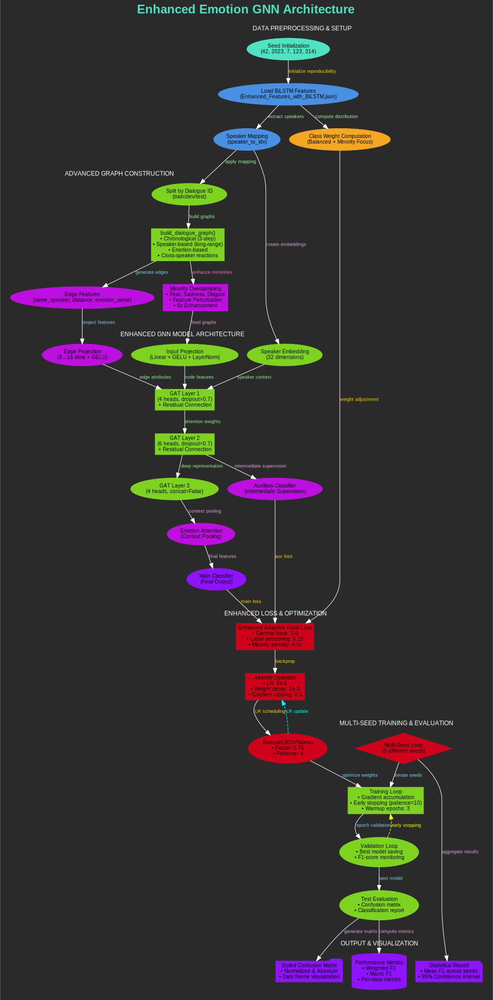

# Enhanced Emotion GNN Architecture Documentation

## Objective

This system implements multi-modal emotion classification in dialogues using Graph Neural Networks with enhanced minority class handling and statistical robustness across multiple seeds, designed to improve classification performance for underrepresented emotions while maintaining statistical validity through comprehensive evaluation protocols.

## Architecture Overview

The complete workflow of the enhanced emotion GNN architecture demonstrates data flow from multi-seed initialization through graph construction to statistical evaluation and visualization, as illustrated below.

*`Figure 1: Complete workflow of the enhanced emotion GNN architecture showing data flow from multi-seed initialization through graph construction to statistical evaluation and visualization.`*

## Architectural Pipeline

### Data Preprocessing & Setup
>*Blue/Teal Components*

The Multi-seed initialization implements seeds (42, 2023, 7, 123, 314) to ensure statistical validity across multiple experimental runs. BiLSTM features are loaded from enhanced feature extraction pipeline providing rich contextual representations. Speaker mapping establishes dialogue participant relationships while balanced class weight computation focuses on minority class enhancement for improved performance on underrepresented emotions.

### Advanced Graph Construction
>*Green/Magenta Components*

#### Graph Creation System
Dialogue-based graph creation implements sophisticated edge relationships through chronological connections with 3-step context window for temporal understanding, speaker-based long-range dependencies for conversational flow modeling, emotion-based clustering with similarity thresholds for semantic grouping, and cross-speaker reaction modeling for interaction dynamics.

#### Minority Enhancement
Enhanced minority oversampling implements 6x amplification with feature perturbation for robustness, ensuring balanced representation of underrepresented emotion classes while maintaining feature diversity through controlled noise injection.

### Enhanced GNN Architecture
>*Green/Magenta/Purple Components*

#### Input Processing Layer
Input processing performs feature projection with speaker embeddings (32D) for comprehensive participant representation and contextual understanding.

#### Graph Attention Network
Three-layer GAT implements residual connections and attention mechanisms for hierarchical feature learning and long-range dependency modeling.

#### Classification System
Dual classification provides auxiliary (intermediate) and main (final) outputs for multi-level supervision and improved gradient flow.

#### Attention Enhancement
Emotion attention pooling performs contextual feature enhancement through selective focus on emotion-relevant graph regions.

#### Regularization Framework
Regularization implements high dropout (0.7), edge dropout (0.2), and weight decay for comprehensive overfitting prevention and improved generalization.

### Enhanced Loss & Optimization
>*Red Components*

#### Advanced Loss Function
Enhanced Adaptive Focal Loss implements minority penalty with 4x amplification for targeted improvement of underrepresented classes, combined with label smoothing (0.15) and gamma-based difficulty weighting (3.0) for robust optimization.

#### Optimization Strategy
AdamW optimization incorporates gradient clipping and LR scheduling for stable training dynamics. Warmup epochs and plateau reduction ensure stable convergence across diverse initialization conditions.

### Multi-Seed Training & Evaluation
>*Green/Red Components*

#### Statistical Framework
Multi-seed evaluation ensures statistical significance through comprehensive testing across multiple random initializations for robust performance assessment.

#### Training Management
Gradient accumulation achieves effective batch size of 64 for stable training dynamics. Early stopping with F1-score monitoring prevents overfitting while optimizing minority class performance. Best model persistence per seed maintains optimal checkpoints for comprehensive evaluation.

### Output & Visualization
>*Purple Components*

#### Performance Analysis
Styled confusion matrices provide normalized and absolute count representations for comprehensive performance understanding. Per-class performance metrics focus on minority class analysis with detailed precision, recall, and F1-score reporting.

#### Statistical Reporting
Statistical aggregation across seeds generates confidence intervals for robust performance assessment. Professional visualization with dark theme aesthetics provides publication-ready presentation quality.

## Information Flow

### Pipeline Overview

The `INITIALIZATION PHASE` processes Seed Setup through BiLSTM Loading and Speaker Mapping to Class Weight Computation.

The `GRAPH CONSTRUCTION PHASE` handles Dialogue Splitting through Graph Building and Edge Feature Generation to Minority Enhancement.

The `MODEL ARCHITECTURE PHASE` executes Input Projection through Speaker Embedding and GAT Layers to Attention Pooling and Classification.

The `OPTIMIZATION PHASE` implements Focal Loss Computation through AdamW Optimization to Learning Rate Scheduling.

The `EVALUATION PHASE` conducts Multi-Seed Training through Validation Monitoring and Test Evaluation to Visualization.

The `FEEDBACK LOOPS` enable Early Stopping from Validation to Training Loop and LR Adjustment from Scheduler to Optimizer.

## Key Architectural Innovations

The system implements minority class enhancement through targeted oversampling and loss weighting for improved underrepresented emotion recognition. Multi-scale graph connections capture dialogue dynamics through comprehensive edge relationship modeling. Statistical robustness through multi-seed evaluation ensures reliable performance assessment. Advanced attention mechanisms enable emotion context modeling for enhanced feature learning. Comprehensive regularization prevents overfitting while maintaining generalization capabilities.

## Expected Capabilities

The architecture delivers improved classification of underrepresented emotions including Fear, Sadness, and Disgust through targeted enhancement strategies. Statistical significance is achieved through multi-seed evaluation with confidence intervals for robust performance assessment. The system ensures robust model generalization across different random initializations while providing professional-grade evaluation with publication-ready visualizations for comprehensive analysis.

## Technical Specifications

Multi-seed evaluation uses seeds (42, 2023, 7, 123, 314) for statistical validity. Graph construction implements 3-step chronological windows with speaker-based dependencies and emotion clustering. GNN architecture features 3-layer GAT with residual connections and 32D speaker embeddings. Regularization includes 0.7 dropout, 0.2 edge dropout, and weight decay. Loss function combines Enhanced Adaptive Focal Loss with 4x minority penalty, 0.15 label smoothing, and 3.0 gamma weighting. Training uses AdamW optimization with gradient accumulation for 64 effective batch size and early stopping with F1-score monitoring.

## Implementation Notes

This architecture represents a comprehensive approach to dialogue emotion recognition, combining advanced graph neural networks with statistical robustness and minority class enhancement. The system ensures reliable performance assessment through multi-seed evaluation while maintaining focus on underrepresented emotion classes, delivering superior performance in complex conversational emotion analysis with publication-quality evaluation metrics and visualization capabilities.