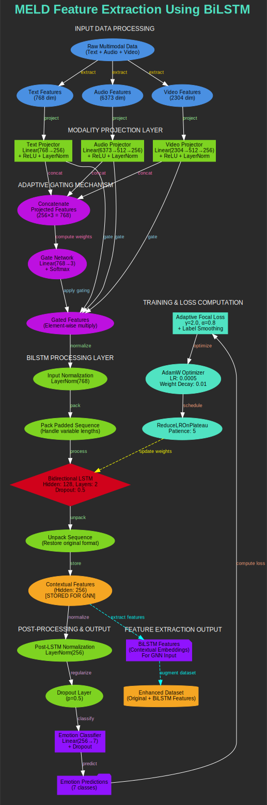

# Multimodal BiLSTM Architecture Documentation

## Objective

This system implements a sophisticated multimodal emotion recognition architecture using Bidirectional LSTM networks with adaptive gating mechanisms, designed specifically for processing text, audio, and video features with contextual understanding and feature extraction for downstream graph neural network processing.

## Architecture Overview

The complete workflow of the multimodal BiLSTM architecture demonstrates data flow from raw multimodal inputs through processing stages to contextual feature extraction and emotion classification, as illustrated below.

*`Figure 1: Complete workflow of the multimodal BiLSTM architecture showing data flow from raw multimodal inputs through processing stages to contextual feature extraction and emotion classification.`*

## Architectural Pipeline

### Input Data Processing
>*Blue Components*

The Raw Multimodal Data integrates text, audio, and video inputs from conversation data sources. Text Features (768D) provide pre-extracted linguistic embeddings from transformer models with rich semantic representations. Audio Features (6373D) deliver comprehensive acoustic feature vectors including prosodic elements for vocal characteristic analysis. Video Features (2304D) supply visual embeddings from facial expressions and gestures for comprehensive multimodal understanding.

### Modality Projection Layer
>*Green Components*

#### Text Processing
Text Projector implements linear transformation (768→256) with ReLU activation and LayerNorm for standardized text feature representation.

#### Audio Processing
Audio Projector performs two-stage projection (6373→512→256) with normalization for dimensionality reduction while preserving acoustic information integrity.

#### Video Processing
Video Projector executes two-stage projection (2304→512→256) with activation and normalization for consistent visual feature representation.

### Adaptive Gating Mechanism
>*Magenta Components*

#### Feature Integration
Feature Concatenation combines all projected features into unified 768D representation for comprehensive multimodal analysis.

#### Attention Weighting
Gate Network learns modality importance weights using Linear(768→3) transformation with Softmax activation for dynamic modality prioritization.

#### Adaptive Processing
Gated Features implement element-wise multiplication for adaptive modality weighting based on contextual relevance.

### BiLSTM Processing Layer
>*Mixed Components*

#### Sequence Preparation
Input Normalization applies LayerNorm preparation for stable sequence processing. Packed Sequence enables efficient handling of variable-length sequences with optimized memory usage.

#### Bidirectional Processing
Bidirectional LSTM serves as the core processing unit with hidden size of 128 per direction (256 total), 2 layers with 0.5 dropout, and forward and backward temporal context capture for comprehensive sequence understanding.

#### Output Processing
Sequence Unpacking restores original sequence format for downstream processing. Contextual Features generate 256D embeddings stored for downstream GNN processing integration.

### Post-Processing & Output
>*Purple/Green Components*

#### Feature Refinement
Post-LSTM Normalization applies final LayerNorm for stable gradients and consistent feature distributions.

#### Regularization
Dropout Regularization implements 0.5 dropout for overfitting prevention and improved generalization.

#### Classification System
Emotion Classifier performs linear transformation (256→7) for emotion categories. Emotion Predictions generate final softmax probabilities for 7 emotion classes with confidence scoring.

### Training & Loss Computation
>*Teal Components*

#### Loss Function
Adaptive Focal Loss handles class imbalance with γ=2.0, α=0.8 parameters and label smoothing for robust minority class performance.

#### Optimization Strategy
AdamW Optimizer provides advanced optimization with learning rate 0.0005 and weight decay 0.01 for improved convergence and generalization.

#### Learning Management
Learning Rate Scheduler implements ReduceLROnPlateau with patience=5 for adaptive learning rate adjustment based on performance plateaus.

### Feature Extraction Output
>*Purple/Orange Components*

#### Contextual Representation
BiLSTM Features provide contextual embeddings extracted for downstream tasks with rich temporal and multimodal information.

#### Dataset Enhancement
Enhanced Dataset augments original data with learned BiLSTM representations for improved downstream processing capabilities.

## Information Flow

### Pipeline Overview

The `FEATURE EXTRACTION PHASE` processes Raw Data through Modality-specific Feature Extraction to Dimensional Alignment.

The `PROJECTION PHASE` handles Multi-dimensional Features through Unified 256D Space to Normalization.

The `GATING PHASE` executes Feature Concatenation through Attention Weight Computation to Adaptive Weighting.

The `SEQUENCE PROCESSING PHASE` performs Gated Features through BiLSTM Processing to Contextual Feature Generation.

The `CLASSIFICATION PHASE` conducts Contextual Features through Normalization and Dropout to Emotion Classification.

The `TRAINING PHASE` implements Predictions through Focal Loss and AdamW Optimization to Learning Rate Scheduling.

The `FEEDBACK LOOPS` enable Weight Updates to BiLSTM Parameters and Feature Extraction to Enhanced Dataset.

## Key Architectural Innovations

The system implements adaptive gating for dynamic modality weighting based on input characteristics. Contextual processing employs bidirectional LSTM to capture both past and future context effectively. Feature extraction stores BiLSTM features for downstream GNN processing integration. Robust training utilizes focal loss to handle class imbalance with label smoothing. Multi-scale processing handles variable-length sequences efficiently. Regularization incorporates multiple dropout layers to prevent overfitting.

## Expected Capabilities

The architecture delivers high-quality contextual embeddings suitable for emotion recognition while providing extracted features for downstream graph neural network processing. The system ensures robust multimodal understanding with adaptive modality weighting and temporal context modeling. Performance optimization handles class imbalance effectively while maintaining generalization across diverse conversation scenarios.

## Technical Specifications

Input processing handles 768D text features, 6373D audio features, and 2304D video features. Projection layers reduce all modalities to unified 256D space with normalization. Adaptive gating uses 768D concatenated features with 3-way softmax weighting. BiLSTM processing employs 2 layers with 128 hidden units per direction and 0.5 dropout. Classification system outputs 7 emotion classes with softmax probabilities. Training utilizes focal loss (γ=2.0, α=0.8), AdamW optimization (LR=0.0005, WD=0.01), and ReduceLROnPlateau scheduling with patience=5.

## Implementation Notes

This architecture represents a comprehensive approach to multimodal emotion recognition, combining advanced sequence modeling with adaptive attention mechanisms and robust training strategies. The system ensures reliable contextual feature extraction while maintaining integration compatibility with downstream graph neural networks, delivering superior performance in complex conversational emotion analysis scenarios.