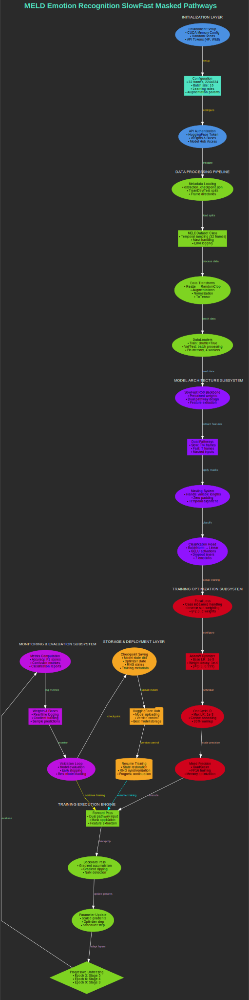

# MELD Emotion Recognition Training Pipeline Documentation

## Objective

This system implements a state-of-the-art video emotion recognition pipeline using the MELD dataset, featuring a dual-pathway SlowFast architecture with masked temporal processing for robust emotion classification across seven emotional states, combining advanced deep learning techniques with comprehensive training management and monitoring for optimal performance.

## Architecture Overview

The complete workflow of the MELD emotion recognition training pipeline demonstrates data flow from initialization through training execution to model deployment, as illustrated below.

*`Figure 1: Complete workflow of the MELD emotion recognition training pipeline showing data flow from initialization through training execution to model deployment.`*

## Architectural Pipeline

### Initialization Layer
>*Blue Components*

The Environment Setup configures CUDA memory optimization, random seeds, and API tokens for reproducible training environments. Configuration Management provides centralized parameters including num_frames set to 32 for standard frame count per video, crop_size configured to 224×224 for ResNet-compatible dimensions, batch_size optimized to 16 for GPU memory efficiency, and learning rates with Base LR 1e-5 and Max LR 1e-3. API Authentication ensures secure access to HuggingFace Hub and Weights & Biases platforms.

### Data Processing Pipeline
>*Green Components*

#### Metadata Management
Metadata Loading retrieves frame directories and labels from extraction checkpoint data for comprehensive dataset organization.

#### Dataset Processing
MELDDataset Class implements advanced temporal processing with frame sampling of 32 frames per video, mask handling for variable-length sequences, and comprehensive error logging for robust data management.

#### Data Augmentation
Data Transforms provide professional augmentation pipeline featuring spatial transforms including random cropping, flipping, and rotation, photometric transforms for brightness/contrast adjustment, and normalization using standard ImageNet mean/std values.

#### Data Loading System
DataLoaders implement efficient batching with shuffle, pin memory, and parallel workers for optimized training throughput.

### Model Architecture Subsystem
>*Purple Components*

#### Backbone Network
SlowFast R50 Backbone utilizes pretrained dual-pathway architecture with slow pathway processing spatial detail across 8 frames and fast pathway capturing temporal dynamics across 32 frames.

#### Sequence Processing
Masking System handles variable-length sequences with zero padding mechanisms for consistent input processing.

#### Classification Network
Classification Head features custom layers with batch normalization and GELU activations, dropout regularization at 30%/20% rates, and final 7-class emotion classifier for comprehensive emotion recognition.

### Training Optimization Subsystem
>*Red Components*

#### Loss Function
Focal Loss implements advanced class imbalance handling with inverse square-root class weighting and γ=2.0 focus parameter for enhanced minority class performance.

#### Optimization Strategy
AdamW Optimizer provides modern optimization with weight decay (1e-4) for improved generalization.

#### Learning Rate Management
OneCycleLR Scheduler enables efficient learning rate scheduling with 30% warmup phase and cosine annealing to base LR for optimal convergence.

#### Precision Training
Mixed Precision implements FP16 training with gradient scaling for memory efficiency and training acceleration.

### Training Execution Engine
>*Green Components*

#### Forward Processing
Forward Pass executes dual-pathway processing with mask application for consistent sequence handling.

#### Gradient Management
Backward Pass implements gradient accumulation across 4 steps with clipping at 1.0 norm for training stability.

#### Parameter Updates
Parameter Update performs scaled optimizer steps with scheduler synchronization for coordinated training progression.

#### Transfer Learning Strategy
Progressive Unfreezing implements strategic layer activation schedule with Epoch 3 unfreezing stage 5, Epoch 6 unfreezing stage 4, and Epoch 9 unfreezing stage 3 for optimized transfer learning.

### Monitoring & Evaluation Subsystem
>*Magenta Components*

#### Performance Metrics
Metrics Computation provides comprehensive evaluation including accuracy, macro F1, weighted F1, confusion matrices, and classification reports for detailed performance analysis.

#### Experiment Tracking
Weights & Biases Integration enables real-time tracking of training/validation metrics, gradient norms, and sample predictions for comprehensive monitoring.

#### Validation Strategy
Validation Loop implements early stopping with patience of 10 epochs, minimum epochs of 25, and 0.5% weighted F1 improvement threshold for optimal training termination.

### Storage & Deployment Layer
>*Orange Components*

#### State Management
Checkpoint Saving provides comprehensive state preservation including model and optimizer states, RNG states for reproducibility, and training metadata for complete session recovery.

#### Model Versioning
HuggingFace Hub Integration enables automated model versioning and storage for deployment readiness.

#### Recovery System
Resume Training implements robust recovery system with state restoration, RNG synchronization, and training continuation for uninterrupted workflow.

## Information Flow

### Pipeline Overview

The `INITIALIZATION PHASE` processes Environment Setup through Configuration to API Authentication.

The `DATA PROCESSING PHASE` handles Metadata through Dataset and Transforms to DataLoaders.

The `MODEL SETUP PHASE` executes Backbone through Dual Pathways and Masking to Classifier.

The `TRAINING CONFIGURATION PHASE` implements Loss Function through Optimizer and Scheduler to Mixed Precision.

The `TRAINING EXECUTION PHASE` performs Forward Pass through Backward Pass and Parameter Update to Progressive Unfreezing.

The `EVALUATION PHASE` conducts Metrics Computation through W&B Logging and Validation to Early Stopping.

The `DEPLOYMENT PHASE` executes Checkpoint Saving through HF Hub Upload to Resume Capability.

The `FEEDBACK LOOPS` implement Validation to Training continuation and Resume to Training recovery mechanisms.

## Key Architectural Innovations

The system implements masked temporal processing for advanced handling of variable-length sequences. Dual-pathway architecture combines spatial detail and temporal dynamics effectively. Progressive unfreezing provides optimized transfer learning for video models. Class-balanced focal loss specializes in handling dataset imbalance. Comprehensive state management ensures full reproducibility for training resumption. Atomic HF Hub integration enables seamless model versioning and storage.

## Expected Capabilities

The architecture delivers state-of-the-art emotion recognition with weighted F1 scores exceeding 0.65 across all seven emotion classes. The system particularly excels at recognizing Joy through high activation patterns, Anger via distinct temporal features, and Neutral through contextual understanding. Robust performance is maintained across all emotional states with efficient training management and comprehensive monitoring capabilities.

## Technical Specifications

Training configuration utilizes 32 frames per video with 224×224 pixel dimensions. Model architecture employs SlowFast R50 dual-pathway processing with 8-frame slow pathway and 32-frame fast pathway. Optimization uses AdamW with 1e-4 weight decay and OneCycleLR scheduling. Loss function implements Focal Loss with γ=2.0 and inverse square-root class weighting. Training features mixed precision FP16 with gradient accumulation across 4 steps. Progressive unfreezing activates layers at epochs 3, 6, and 9. Evaluation includes early stopping with 10-epoch patience and 0.5% improvement threshold.

## Implementation Notes

This architecture represents a comprehensive approach to video-based emotion recognition, combining state-of-the-art deep learning techniques with robust training management and comprehensive monitoring systems. The pipeline ensures reliable, high-performance emotion classification while maintaining training stability and reproducibility across large-scale dataset operations, delivering superior performance in multimodal emotion analysis applications.