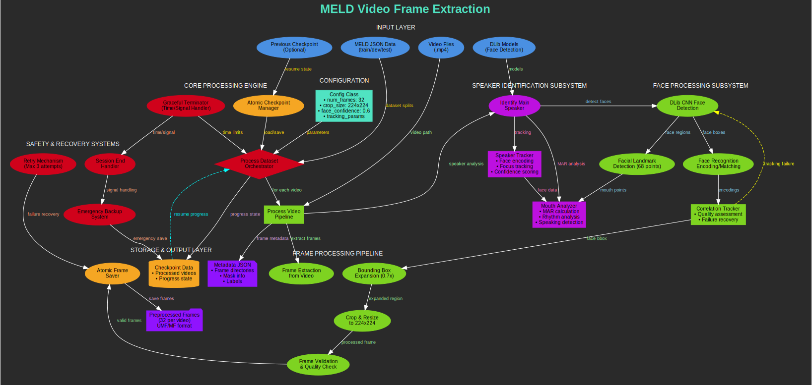

# MELD Video Frame Extraction Architecture Documentation

## Objective

This system implements a sophisticated video frame extraction and preprocessing pipeline specifically designed for the MELD emotion recognition dataset, featuring intelligent speaker identification, robust face tracking, and atomic processing with comprehensive safety mechanisms.

## Architecture Overview

The complete workflow of the MELD video frame extraction architecture demonstrates data flow from input video files through processing stages to preprocessed frame output, as illustrated below.

*`Figure 1: Complete workflow of the MELD video frame extraction architecture showing data flow from input video files through processing stages to preprocessed frame output.`*

## Architectural Pipeline

### Input Layer
>*Blue Components*

The MELD JSON Data serves as structured dataset splits containing train/dev/test partitions with video paths and labels. Video Files (.mp4) provide raw multimodal conversation videos requiring frame extraction. Previous Checkpoint (Optional) enables resume capability from interrupted processing sessions. DLib Models supply pre-trained CNN face detection and 68-point facial landmark models.

### Configuration Layer
>*Teal Components*

The Config Class implements centralized parameter management including num_frames set to 32 for standard frame count per video, crop_size configured to 224×224 for ResNet-compatible dimensions, face_confidence threshold at 0.6 for detection accuracy, and tracking_params for correlation tracker settings and failure recovery mechanisms.

### Core Processing Engine
>*Diamond/Control Components*

The Process Dataset Orchestrator functions as the main workflow coordinator managing split-wise processing operations. The Atomic Checkpoint Manager ensures data integrity with emergency backup capabilities. The Graceful Terminator provides time-based and signal-based session management with automatic save functionality.

### Speaker Identification Subsystem
>*Magenta Components*

#### Main Speaker Detection
The Identify Main Speaker component performs primary speaker detection across entire video sequences through advanced algorithms.

#### Speaker Tracking System
The Speaker Tracker implements advanced tracking featuring face encoding comparison with similarity thresholds, dynamic focus tracking with confidence scoring, and centrality weighting for main speaker detection accuracy.

#### Mouth Analysis Engine
The Mouth Analyzer performs sophisticated speech activity detection through Mouth Aspect Ratio (MAR) calculation from facial landmarks, rhythm analysis with peak/valley detection, and speaking pattern consistency scoring for enhanced accuracy.

### Face Processing Subsystem
>*Green Processing Components*

#### Face Detection Module
DLib CNN Face Detection provides high-accuracy face detection with confidence scoring mechanisms for reliable identification.

#### Face Recognition System
Face Recognition Encoding/Matching generates 128-dimensional face embeddings with similarity comparison algorithms for consistent speaker tracking.

#### Correlation Tracking Engine
The Correlation Tracker implements robust face tracking featuring quality assessment with configurable thresholds, automatic failure recovery and re-initialization, and multi-frame tracking consistency validation.

#### Landmark Detection System
Facial Landmark Detection extracts 68-point facial landmarks for comprehensive mouth analysis and expression capture.

### Frame Processing Pipeline
>*Green Sequential Components*

The Frame Extraction from Video utilizes OpenCV-based video decoding and frame sampling techniques. Bounding Box Expansion (0.7x) provides context-aware region expansion around detected faces. Crop & Resize to 224×224 implements standard preprocessing for deep learning model compatibility. Frame Validation & Quality Check ensures frame quality and completeness verification.

### Storage & Output Layer
>*Purple/Orange Components*

#### Frame Storage System
The Atomic Frame Saver implements fault-tolerant file writing with temporary file mechanisms for data integrity.

#### Preprocessed Frame Output
Preprocessed Frames generate organized storage producing 32 frames per video in UMF (Useful Masked Frame) and MF (Masked Frame) formats with hierarchical directory structure by dataset split.

#### Metadata Management
Metadata JSON provides comprehensive metadata including frame directory paths and mask information, original labels and video identifiers for complete traceability.

#### Progress Tracking
Checkpoint Data maintains persistent progress tracking with processed video lists for session continuity.

### Safety & Recovery Systems
>*Red Control Components*

The Emergency Backup System implements multi-level backup strategy with tar.gz compression for data protection. Session End Handler provides signal-based graceful shutdown with state preservation. Retry Mechanism offers configurable retry logic with maximum 3 attempts for failure recovery.

## Information Flow

### Pipeline Overview

The `INITIALIZATION PHASE` processes Dataset JSON through Configuration and Checkpoint Loading to Previous State Recovery.

The `PROCESSING PHASE` handles Video Input through Speaker Identification and Face Detection/Tracking to Frame Extraction.

The `ANALYSIS PHASE` performs Mouth Analysis through Speaking Pattern Detection to Main Speaker Focus Determination.

The `PROCESSING PHASE` executes Bounding Box Expansion through Crop/Resize and Quality Validation to Atomic Saving.

The `SAFETY MECHANISMS` maintain Continuous checkpoint saving through Signal handling and Emergency backup to Graceful termination.

The `FEEDBACK LOOPS` implement Tracking Failure to Face Re-detection and Checkpoint Data to Progress Resume.

## Key Architectural Innovations

The system implements intelligent speaker identification using both facial recognition and mouth movement analysis. Robust face tracking employs correlation tracking with quality assessment and failure recovery. Atomic operations ensure data integrity through temporary file mechanisms. Progressive processing enables split-wise processing with comprehensive checkpointing. Emergency safety provides multi-level backup systems with signal handling. Quality assurance includes frame validation and mask information generation.

## Expected Capabilities

The architecture provides consistently sized speaker-focused frame sequences suitable for emotion recognition models. The system handles variable-length videos and speaker changes robustly. High-quality preprocessing ensures optimal performance for downstream deep learning tasks. Scalable processing design accommodates large-scale dataset operations with resume capability.

## Technical Specifications

Input processing handles MELD JSON data and MP4 video files. Frame extraction produces exactly 32 frames per video with 224×224 pixel dimensions. Face detection utilizes DLib CNN with 0.6 confidence threshold. Speaker identification combines face encoding with mouth movement analysis. Tracking system implements correlation tracking with quality assessment. Storage system generates UMF and MF frame types with hierarchical organization. Safety mechanisms include atomic operations, checkpointing, and emergency backup systems.

## Implementation Notes

This architecture represents a comprehensive approach to video preprocessing for emotion recognition, combining advanced computer vision techniques with robust data management and safety mechanisms. The system ensures reliable, high-quality frame extraction suitable for multimodal emotion analysis while maintaining data integrity and processing continuity across large-scale dataset operations.